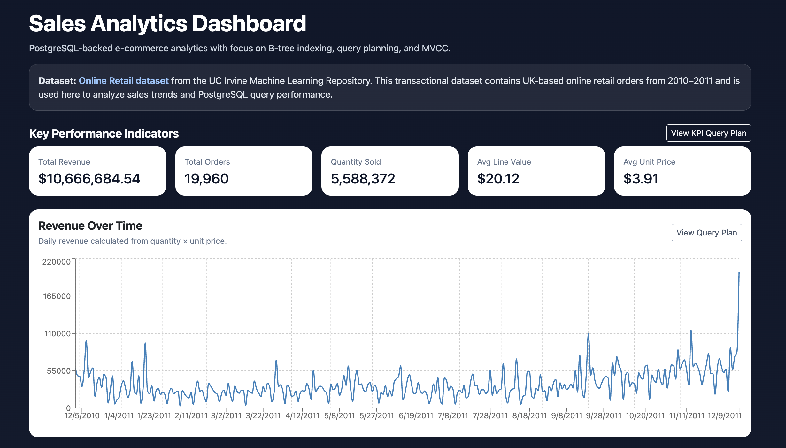
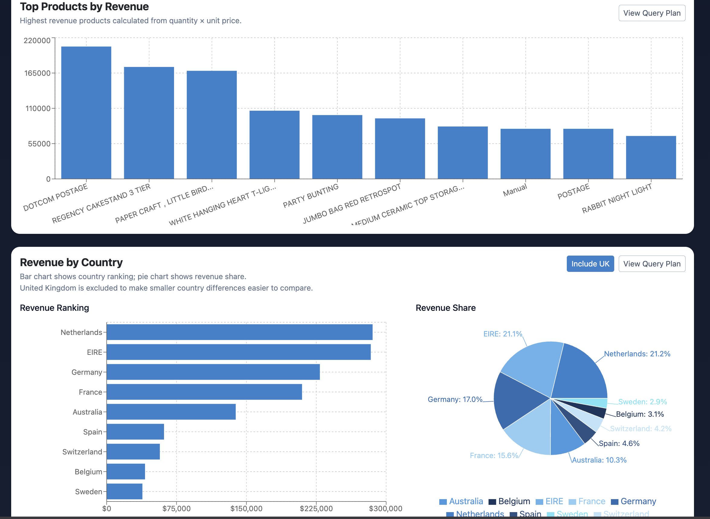
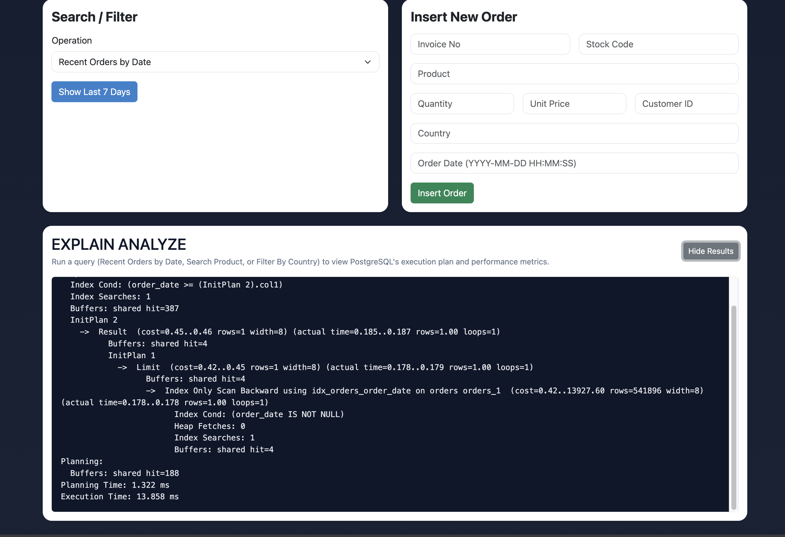

# Sales Analytics PostgreSQL Dashboard

## Project Description

This project is a PostgreSQL-backed e-commerce sales analytics dashboard built with React, Express, Node.js, and PostgreSQL. The application uses the Online Retail dataset from the UC Irvine Machine Learning Repository to analyze sales transactions, visualize business trends, and demonstrate how PostgreSQL query planning, B-tree indexing, aggregation, and `EXPLAIN ANALYZE` affect application behavior.

Dataset source: https://archive.ics.uci.edu/dataset/352/online+retail

---

## Project Setup / Requirements

### Required Software

- Node.js and npm
- PostgreSQL
- pgAdmin or psql
- Git
- Code editor such as VS Code

### Environment Variables

The backend uses a `.env` file for PostgreSQL connection settings. 

A safe `.env.example` file should also be included in the repository:

```env
PORT=5001
DB_HOST=localhost
DB_PORT=5432
DB_NAME=sales_analytics
DB_USER=postgres
DB_PASSWORD=your_postgres_password_here
```

Create a `backend/.env` file using `.env.example` as a template. Replace `DB_PASSWORD` with your local PostgreSQL password.

---

## Dataset Setup

This project uses the Online Retail dataset from the UC Irvine Machine Learning Repository.

### Dataset Instructions

1.  The dataset file is already included in this repository:

```text
database/OnlineRetail.csv
```

2. Create the PostgreSQL database:

```sql
CREATE DATABASE sales_analytics;
```

3. Run this command from the project root in a terminal:

```bash
psql -U postgres -d sales_analytics -f database/schema.sql
```

4. Load `database/OnlineRetail.csv` into the `orders` table using pgAdmin's Import/Export tool or a psql `COPY` command. Make sure the CSV headers match the table columns defined in `schema.sql`.

5. Run the indexes file:

```bash
psql -U postgres -d sales_analytics -f database/indexes.sql
```

---

## Install Dependencies

### Backend

```bash
cd backend
npm install
```

### Frontend

```bash
cd frontend
npm install
```

---

## Run the Application

### Start the Backend

From the `backend/` folder:

```bash
node server.js
```

The backend runs on:

```text
http://localhost:5001
```

### Start the Frontend

From the `frontend/` folder:

```bash
npm run dev
```

The frontend runs on:

```text
http://localhost:5173
```

Open the frontend URL in the browser to use the dashboard.

---

## Screenshots

The application runs locally. The screenshots below show the completed dashboard interface, analytics visualizations, and PostgreSQL `EXPLAIN ANALYZE` query plan output.

### Dashboard Overview

Shows the dashboard header, dataset source, KPI cards, and revenue-over-time chart.



### Analytics Charts

Shows top products by revenue and revenue by country with the include/exclude UK toggle.



### EXPLAIN ANALYZE Output

Shows PostgreSQL query plan output for a user query, including index usage, planning time, and execution time.



---

## Tech Stack

- PostgreSQL: relational database system used to store and query the e-commerce transaction data.
- Express and Node.js: backend server and REST API layer for connecting the frontend to PostgreSQL.
- React and Vite: frontend dashboard framework and development environment.
- Recharts: charting library used for revenue visualizations.
- Bootstrap/CSS: layout, cards, forms, and dashboard styling.
- UCI Online Retail dataset: real-world transactional e-commerce dataset.

---

## Application Operations

### Recent Orders

- Shows the most recent orders based on the latest order date in the dataset.

### Product Search

- Allows users to search for orders by product name.

### Country Filter

- Allows users to filter orders by country.

### Insert New Order

- Allows users to manually insert a new order into the PostgreSQL database.

### KPI Cards

- Displays total revenue, total orders, quantity sold, average line value, and average unit price.

### Revenue Over Time Chart

- Displays daily revenue using `quantity × unit_price`.

### Top Products by Revenue Chart

- Displays the highest revenue-generating products.

### Revenue by Country Chart

- Displays revenue ranking and revenue share by country.
- Includes a bar chart, pie chart, and an include/exclude UK toggle to handle the United Kingdom as a dominant outlier.

### EXPLAIN ANALYZE Panel

- Shows PostgreSQL query plans for user-driven queries such as recent orders, product search, and country filtering.
- Helps connect the dashboard’s results to database internals such as sequential scans, index scans, sorting, aggregation, planning time, and execution time.

---

## Database Internals Demonstrated

### B-tree Indexing

- B-tree indexes are used to speed up queries on fields such as `order_date`, `product`, and `country`.
- The application demonstrates how indexed queries can reduce the need for full table scans.

### Query Planning

- PostgreSQL’s query planner selects execution strategies such as sequential scans, index scans, sorting, and aggregation.
- `EXPLAIN ANALYZE` is used to view actual planning time and execution time.

### Aggregation

- The dashboard uses aggregation queries for KPI cards and revenue charts.
- Examples include `SUM(quantity * unit_price)`, `COUNT(DISTINCT invoice_no)`, and `GROUP BY` operations.

### MVCC / Transaction Behavior

- PostgreSQL supports concurrent reads and writes using Multi-Version Concurrency Control.
- The insert feature conceptually demonstrates how new transactions can be added while users continue querying the dashboard.

---

## API Routes

### Order Routes

```text
GET    /api/orders/recent
GET    /api/orders/product?search=value
GET    /api/orders/country?country=value
POST   /api/orders
```

### Analytics Routes

```text
GET    /api/analytics/summary
GET    /api/analytics/revenue-over-time
GET    /api/analytics/top-products
GET    /api/analytics/revenue-by-country
```

### EXPLAIN ANALYZE Routes

```text
GET    /api/explain/recent
GET    /api/explain/product?search=value
GET    /api/explain/country?country=value
GET    /api/explain/summary
GET    /api/explain/revenue-over-time
GET    /api/explain/top-products
GET    /api/explain/revenue-by-country
```

---

## Project Structure

```text
sales-analytics-postgresql/
│
├── backend/
│   ├── routes/
│   │   └── orders.js
│   ├── .env
│   ├── .env.example
│   ├── db.js
│   ├── package.json
│   └── server.js
│
├── database/
│   ├── cleanup.sql
│   ├── demo_queries.sql
│   ├── indexes.sql
│   ├── OnlineRetail.csv
│   └── schema.sql
│
├── frontend/
│   ├── public/
│   ├── src/
│   │   ├── components/
│   │   │   ├── ExplainPanel.jsx
│   │   │   ├── Header.jsx
│   │   │   ├── InsertOrderForm.jsx
│   │   │   ├── KpiCards.jsx
│   │   │   ├── OrdersTable.jsx
│   │   │   ├── RevenueByCountryChart.jsx
│   │   │   ├── RevenueOverTimeChart.jsx
│   │   │   ├── SearchPanel.jsx
│   │   │   └── TopProductsChart.jsx
│   │   ├── styles/
│   │   │   └── App.css
│   │   ├── App.jsx
│   │   ├── index.css
│   │   └── main.jsx
│   ├── index.html
│   ├── package.json
│   └── vite.config.js
│
├── .gitignore
└── README.md
```

---

## Reproducing Results

To reproduce the dashboard results:

1. Install PostgreSQL and create the `sales_analytics` database.
2. Confirm that `database/OnlineRetail.csv` exists in the repository.
3. Run the schema and index SQL files.
4. Configure the backend `.env` file.
5. Start the backend server.
6. Start the frontend development server.
7. Open the dashboard in the browser.
8. Use the search, filter, chart, and query plan buttons to reproduce the analytics and PostgreSQL `EXPLAIN ANALYZE` outputs.

---

## Notes on Credentials

This project does not require external API keys. It does require local PostgreSQL credentials in the backend `.env` file.
